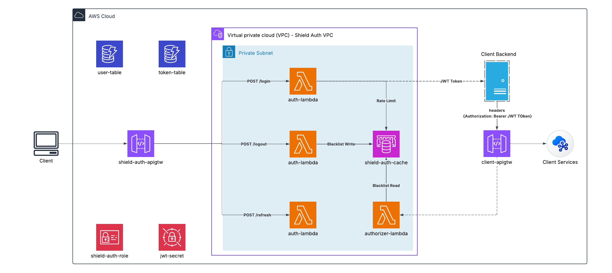

# shield-auth

Servicio centralizado de autenticación y autorización. Expone una API HTTP para login, refresh y logout de usuarios, y un Lambda Authorizer que valida tokens JWT en el API Gateway antes de que lleguen a otros servicios.

---

## Índice

- [Arquitectura](#arquitectura)
- [API Reference](#api-reference)
  - [Endpoints](#endpoints)
  - [Códigos de error](#códigos-de-error)
- [Instalación y desarrollo local](#instalación-y-desarrollo-local)
- [CI/CD](#cicd)
  - [Pipelines](#pipelines)
  - [Secretos requeridos](#secretos-requeridos)

---

## Arquitectura



### Recursos AWS

| Recurso | Nombre | Descripción |
|---|---|---|
| API Gateway HTTP | `UE1SHIELDAUTHGTW001` | Entry point HTTP |
| Lambda `auth-service` | `UE1SHIELDAUTHLMB001` | Login / Refresh / Logout |
| Lambda `authorizer` | `UE1SHIELDAUTHLMB002` | Validación JWT + blacklist |
| DynamoDB `users` | `UE1SHIELDAUTHDDB001` | Tabla de usuarios |
| DynamoDB `refresh-tokens` | `UE1SHIELDAUTHDDB002` | Refresh tokens activos |
| ElastiCache Redis | — | Rate limiting + blacklist de tokens |
| IAM Role | `UE1SHIELDAUTHROL001` | Rol de ejecución compartido |

---

## API Reference

### Endpoints

#### POST `/auth/login`

Autentica un usuario y devuelve un par de tokens.

**Body:**
```json
{ "email": "user@example.com", "password": "secret" }
```

**Response `200`:**
```json
{
  "data": {
    "accessToken": "<jwt>",
    "refreshToken": "<uuid>",
    "expiresIn": 900
  }
}
```

---

#### POST `/auth/refresh`

Rota el refresh token y devuelve un nuevo par.

**Body:**
```json
{ "refreshToken": "<uuid>" }
```

**Response `200`:**
```json
{
  "data": {
    "accessToken": "<jwt>",
    "refreshToken": "<uuid>",
    "expiresIn": 900
  }
}
```

---

#### POST `/auth/logout`

Revoca el refresh token y añade el access token a la blacklist.

**Headers:** `Authorization: Bearer <accessToken>`

**Body:**
```json
{ "refreshToken": "<uuid>" }
```

**Response `200`:**
```json
{
  "data": { "message": "Sesión cerrada correctamente" }
}
```

---

### Códigos de error

| Código | HTTP | Descripción |
|---|---|---|
| `APP-001` | 500 | Error inesperado |
| `APP-002` | 500 | Variable de entorno faltante |
| `APP-003` | 400 | Body de request inválido |
| `AUTH-001` | 401 | Credenciales inválidas |
| `AUTH-002` | 429 | Demasiados intentos fallidos |
| `AUTH-003` | 401 | Token inválido o expirado |
| `AUTH-004` | 401 | Refresh token ya fue rotado |
| `AUTH-005` | 401 | Usuario asociado al token no existe |

---

## Instalación y desarrollo local

```bash
# Instalar dependencias
npm install

# Tests unitarios
npm test
```

---

## Desarrollo en LocalStack

> Copiar `.env.example` a `.env` y completar `LOCALSTACK_AUTH_TOKEN`.

```bash
# Levantar LocalStack + Redis
docker compose up -d

# Instalar CLI (una sola vez)
npm install -g aws-cdk aws-cdk-local
pip install awscli-local

# Bootstrap + deploy
cd cdk
cdklocal bootstrap
cdklocal deploy --require-approval never
```

---

## Despliegue en AWS

```bash
# Bootstrap (una vez por cuenta/región)
cdk bootstrap aws://<ACCOUNT_ID>/us-east-1

# Preview de cambios
cdk diff

# Deploy
cdk deploy --require-approval never

# Destruir el stack
cdk destroy
```

> URL del endpoint: `https://{id}.execute-api.us-east-1.amazonaws.com/prod/v1/{path}`

---

## CI/CD

### Pipelines

| Archivo | Trigger | Acción |
|---|---|---|
| `deploy.yml` | `pull_request` / `push` a `master` | Build + Deploy en AWS |

### Secretos requeridos

Configurar en GitHub → Settings → Environments:

**`deployer`:**
```
AWS_ACCESS_KEY_ID
AWS_SECRET_ACCESS_KEY
CDK_DEFAULT_ACCOUNT
AWS_DEFAULT_REGION
JWT_SECRET
```

**`deployer-local`:**
```
LOCALSTACK_AUTH_TOKEN
```

---